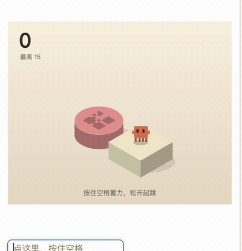
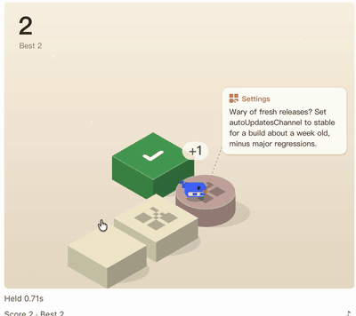

# AGI Hunt Mods

[English](README.md) · **简体中文**

AGI Hunt 出品的 [Claude Code Mods](https://code.claude.com/docs/en/plugins/mods/overview)：在 Claude Code 里画面板、加提示、做小游戏的插件。欢迎一起来做。

<p align="center">
  
  &nbsp;
  
</p>

## 安装

在 Claude Code 桌面端（2.1.287 或更新）里输入：

```
/plugin marketplace add AGIHunt/cc-mods
/plugin install hop@agihunt
```

## Mods

| Mod | 是什么 |
|---|---|
| [蹦一蹦 hop](plugins/hop/README.zh-CN.md) | 等 Claude 干活时玩的跳一跳。按住空格蓄力，松开起跳；每块方块带一张 AI 编程知识卡片（596 张，讲 Claude Code、Codex、DSH、Cursor 等），可选排行榜 |

## DeepSeek Harness 也能玩

蹦一蹦有一个 [DeepSeek Harness 版](dsh/hop/README.zh-CN.md)（主角是小鲸鱼）。在 DSH 侧栏 **插件 → 添加插件** 填入：

```
github:AGIHunt/cc-mods#path:dsh/hop
```

或者命令行：`dsh plugin --profile desktop add "github:AGIHunt/cc-mods#path:dsh/hop"`。

## 语言

蹦一蹦支持中文和英文。

- **Claude Code：** 默认跟随系统语言。想固定一种：输入 `/plugin`，打开 **hop**，把 **Language** 设成 `zh` 或 `en`（`auto` 跟随系统），新开一个会话生效。
- **DeepSeek Harness：** 跟随 DSH 的界面语言（设置 → 语言）。

## 参与

- 加一张知识卡片：改 [`plugins/hop/data/facts.json`](plugins/hop/data/facts.json) 提 PR
- 改进蹦一蹦：看 [plugins/hop/README.zh-CN.md](plugins/hop/README.zh-CN.md) 的代码地图
- 做一个新 Mod：`cp -r templates/starter-mod plugins/my-mod`

详细步骤、Mod 守则和桌面端踩过的坑都在 [CONTRIBUTING.zh-CN.md](CONTRIBUTING.zh-CN.md)。


[MIT License](LICENSE)
